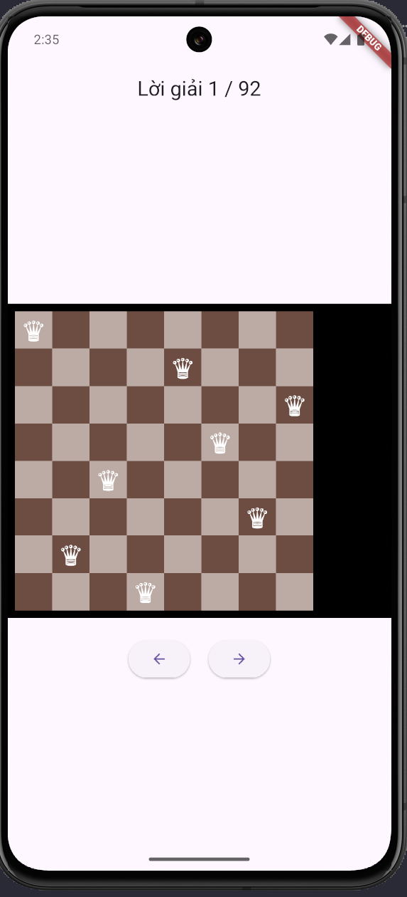
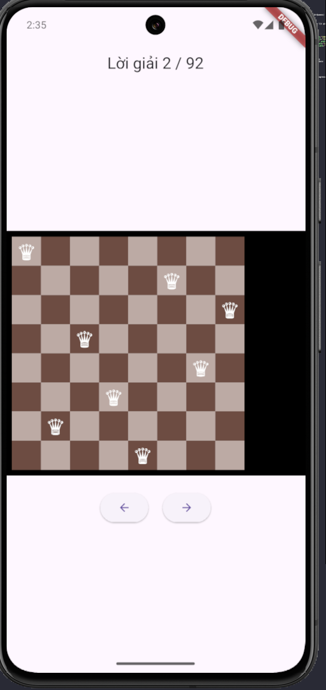
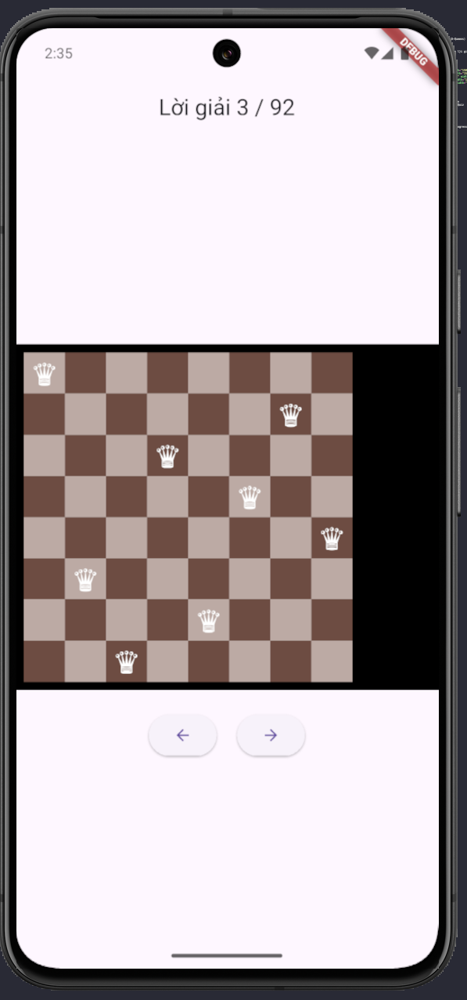
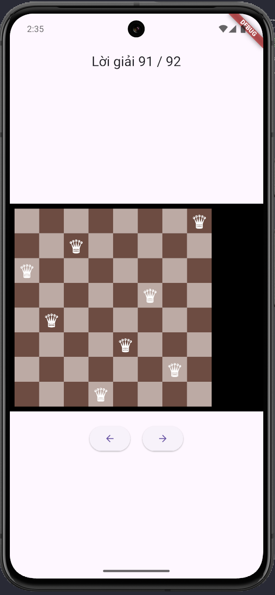
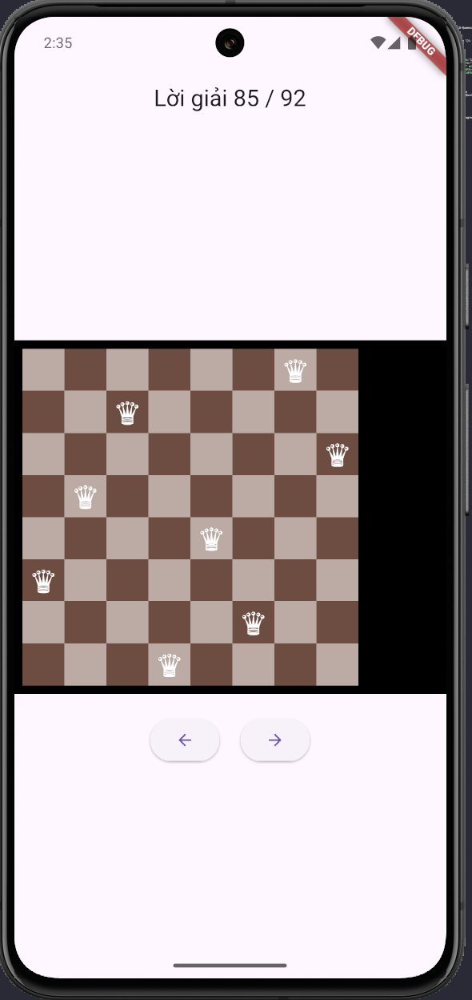

# Dự án Flutter: Giải bài toán 8 quân hậu
Ứng dụng Flutter hiển thị **toàn bộ 92 lời giải của bài toán 8 Queens** trên bàn cờ 8x8. 
Người dùng có thể swipe hoặc bấm nút để chuyển giữa các lời giải.

## Giới thiệu
- Dự án này hiện thực thuật toán 8 quân hậu (8-Queens) bằng Flutter:
- Tìm tất cả 92 lời giải của bài toán
- Hiển thị bàn cờ 8×8 giống thật
- Đặt quân hậu bằng ký tự Unicode ♛
- Cho phép người dùng quệt trái / phải để chuyển lời giải
- Viết hoàn toàn bằng Dart + Flutter

## Tính năng
- Hiển thị bàn cờ 8x8 với các quân hậu theo từng lời giải.
- Swipe trái/phải hoặc bấm nút để chuyển lời giải.
- Hiển thị số thứ tự lời giải hiện tại (ví dụ: 1/92).

## Công nghệ sử dụng
- **Flutter**: UI framework
- **Dart**: ngôn ngữ lập trình

## Cách hoạt động
- Thuật toán **Backtracking** tìm toàn bộ 92 lời giải.
- Mỗi lời giải được lưu dưới dạng danh sách vị trí các quân hậu.
- UI đọc danh sách này và vẽ các quân hậu trên bàn cờ.
- GestureDetector bắt swipe và nút để chuyển lời giải.

## Thuật toán sử dụng
Dự án sử dụng thuật toán quay lui (Backtracking) để tìm tất cả các cách đặt 8 quân hậu lên bàn cờ sao cho:
- Không trùng hàng
- Không trùng cột
- Không trùng đường chéo chính
- Không trùng đường chéo phụ
Thuật toán duyệt lần lượt từng hàng (0 → 7), thử đặt một quân hậu tại mỗi cột.
Nếu vị trí hợp lệ → tiếp tục sang hàng tiếp theo.
Nếu cả hàng không đặt được → quay lui.

## Screenshots
<table style="width:100%">
  <tr>
    <td></td>
    <td></td>
    <td></td>
    <td></td>
    <td></td>
  </tr>
</table>

## Cách cài đặt và chạy

```bash
git clone https://github.com/quangau6868/dethuchanhflutter.git
flutter pub get
flutter run
```

## Ý tưởng hiện thực UI
✔️Vẽ bàn cờ
Dùng Container 40×40, màu xen kẽ theo công thức:
```bash
(row + col) % 2 == 0 ? lightColor : darkColor
```

✔️ Vẽ quân hậu
Dùng unicode:
```bash
Text("♛", style: TextStyle(fontSize: 28))
```

✔️ Swipe chuyển lời giải
```bash
GestureDetector(
  onHorizontalDragEnd: (details) {
    if (details.primaryVelocity! < 0) nextSolution();
    else if (details.primaryVelocity! > 0) previousSolution();
  },
)
```

## Kết luận
Dự án giúp bạn:
- Hiểu rõ thuật toán Backtracking
- Thực hành giao diện Flutter dạng grid
- Hiểu cách bắt sự kiện swipe trong Flutter
- Kết hợp thuật toán + UI vào một ứng dụng hữu ích

Nếu bạn muốn mở rộng, có thể thêm:
- Animation chuyển bàn cờ
- Hiển thị nhiều quân hậu bằng hình PNG
- Giải N-Queens (N tùy ý chọn)
- Xuất lời giải ra file JSON

