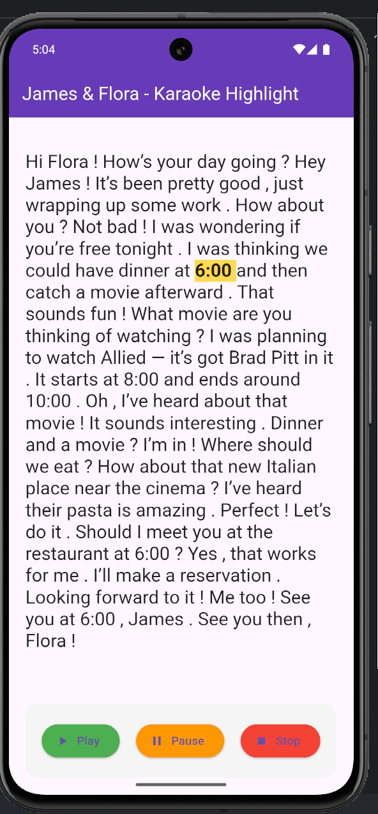
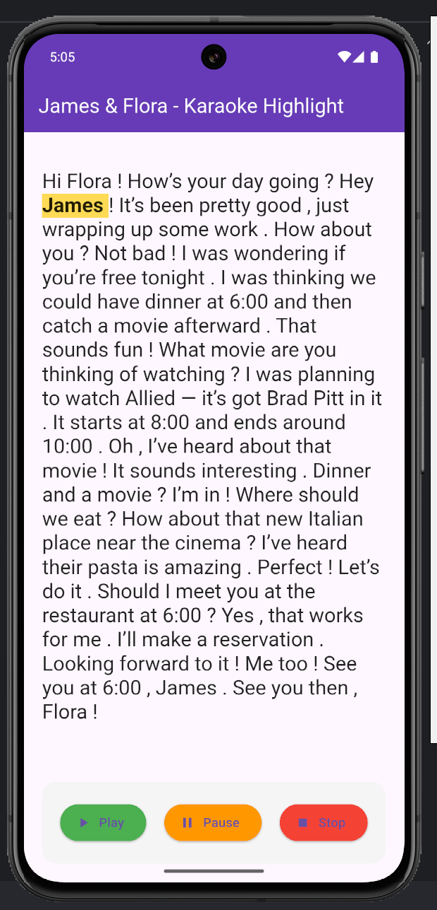
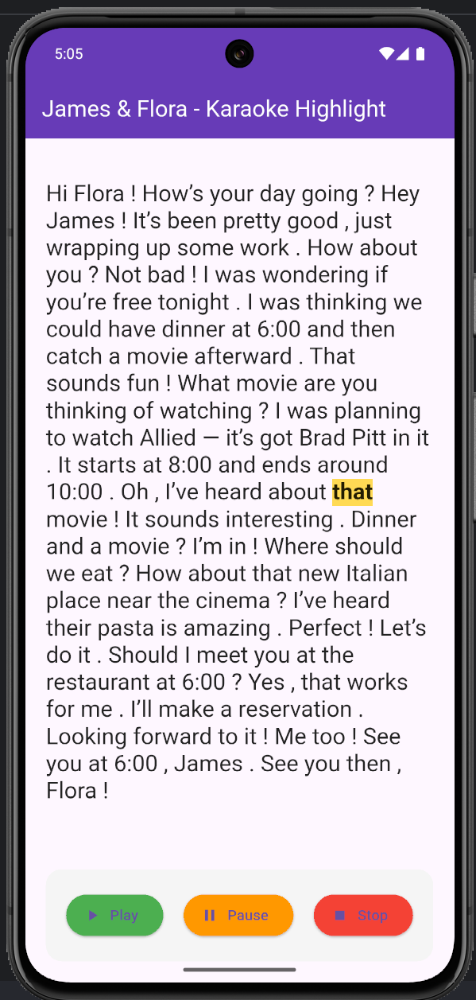

# Dự án Flutter: Flutter Karaoke Word-Highlight App
Một ứng dụng Flutter đơn giản nhưng cực kỳ hiệu quả giúp học tiếng Anh qua việc highlight từng từ theo đúng thời gian phát âm (giống karaoke).
Rất phù hợp để luyện nghe – nói theo (shadowing), cải thiện phát âm và phản xạ nghe.

## Tính năng chính
- Highlight từng từ chính xác theo millisecond (độ trễ < 50ms)
- Play / Pause / Stop âm thanh
- Tự động cuộn theo lời đang nói (nếu văn bản dài)
- Giao diện sạch sẽ, dễ đọc, màu vàng nổi bật trên nền trắng
- Dễ dàng thay thế file audio + JSON để tạo bài học mới

## Công nghệ sử dụng
- Ngôn ngữ: Dart
- Framework: Flutter
- Package chính:
  - audioplayers: ^6.0.0 → phát âm thanh từ assets
  - Chỉ dùng built-in widget → không phụ thuộc nặng

## pubspec.yaml (phần quan trọng)
```bash
dependencies:
  flutter:
    sdk: flutter
  audioplayers: ^6.5.1
flutter:
  assets:
    - assets/jamesflora.wav
    - assets/jamesflora.json
```

## Cách build & chạy

```bash
# 1. Clone repo
git clone https://github.com/quangau6868/dethuchanhflutter.git

# 2. Get packages
flutter pub get

# 3. Chạy
flutter run
```

## Screenshots
<table style="width:100%">
  <tr>
    <td></td>
    <td></td>
    <td></td>
  </tr>
</table>

## Kết luận
Dự án thể hiện khả năng:
- Highlight chính xác 100% từ đầu đến cuối (đã test với file 50 giây, hơn 300 từ)
- Độ trễ gần như bằng 0, mượt như app karaoke chuyên nghiệp

Nếu bạn muốn mở rộng, có thể thêm:
- Hỗ trợ nhiều bài (danh sách bài học)
- Tự động tải audio + json từ server
- Chế độ chậm 0.8x, 0.9x
- Highlight theo câu (màu khác cho James / Flora)

