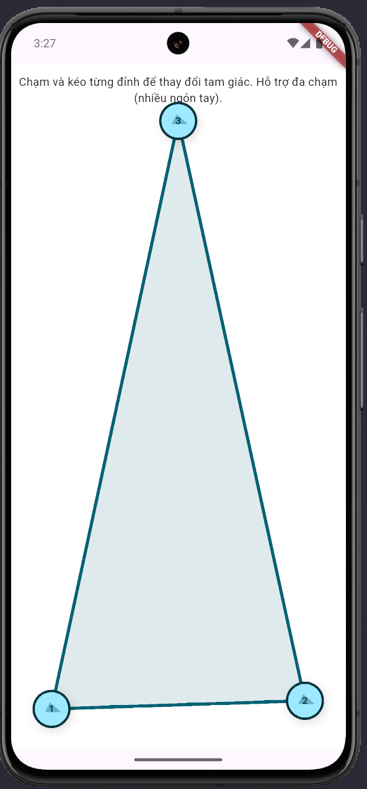
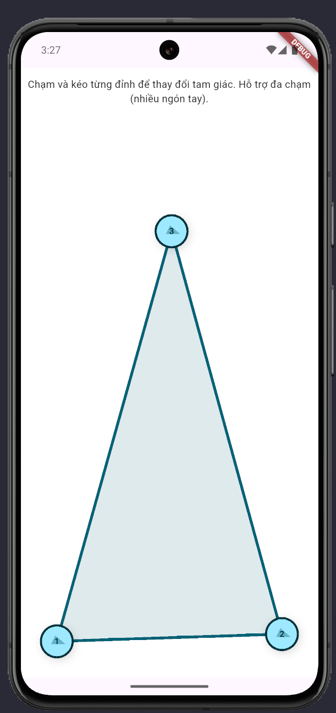
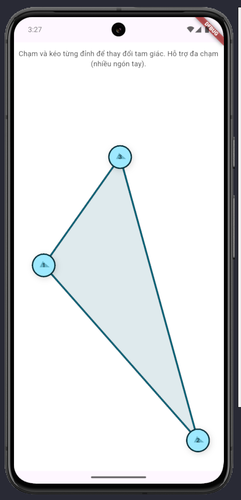
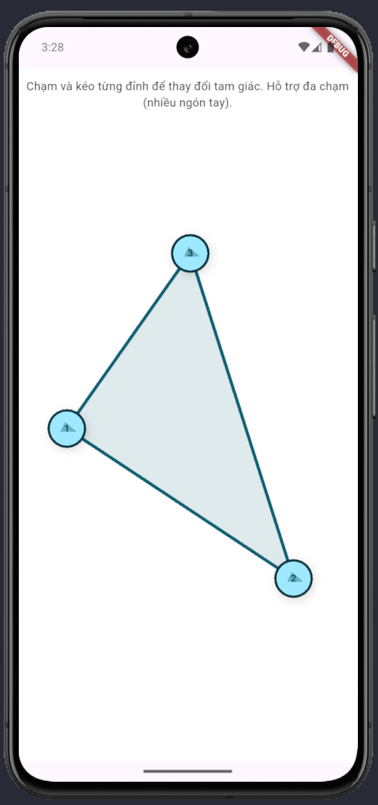

# Dự án Flutter: Vẽ và chỉnh tam giác với xử lý đa chạm (Flutter / Dart)
Ứng dụng là một prototype bằng Flutter cho phép người dùng vẽ một tam giác với 3 đỉnh có thể di chuyển được bằng thao tác chạm và kéo. Hỗ trợ đa chạm — nhiều đầu ngón tay có thể kéo các đỉnh khác nhau cùng lúc. Ứng dụng sử dụng Listener để xử lý pointer events và CustomPainter để render tam giác và các điểm điều khiển.

## Mục tiêu dự án
- Triển khai cơ chế thao tác đa chạm (multi-touch) để điều khiển nhiều đối tượng cùng lúc.
- Cung cấp UI trực quan: hiển thị rõ ràng các đỉnh và cạnh tam giác.
- Viết code sạch, dễ bảo trì, có khả năng mở rộng (ví dụ thêm nhiều đỉnh, thay đổi màu, snap-to-grid...).

## Công nghệ sử dụng
- Ngôn ngữ: Dart
- Framework: Flutter
- Thành phần chính: Listener (pointer events), CustomPainter, StatefulWidget.

## Cấu trúc mã 
- main.dart:
  - TriangleMultiTouchApp: entry point.
  - TriangleEditor (StatefulWidget): quản lý trạng thái 3 đỉnh, ánh xạ pointer -> vertex, nhận pointer events.
  - TrianglePainter (CustomPainter): vẽ các cạnh, fill, và các handle.

## 💡 Cách hoạt động
- Thuật toán **Backtracking** tìm toàn bộ 92 lời giải.
- Mỗi lời giải được lưu dưới dạng danh sách vị trí các quân hậu.
- UI đọc danh sách này và vẽ các quân hậu trên bàn cờ.
- GestureDetector bắt swipe và nút để chuyển lời giải.

## Thuật toán sử dụng
Trong file main.dart, hit-test được triển khai trong hàm:
```bash
int? _hitTestVertex(Offset pos) {
  // trả về index nếu distance < threshold
  final double threshold = handleRadius + 12.0;
  for (int i = 0; i < vertices.length; i++) {
    final double dx = vertices[i].dx - pos.dx;
    final double dy = vertices[i].dy - pos.dy;
    final double dist = sqrt(dx * dx + dy * dy);
    if (dist <= threshold) return i;
  }
  return null;
}
```

Hàm này được gọi trong onPointerDown():
```bash
void _onPointerDown(PointerDownEvent event) {
  final pos = event.localPosition;
  final int? found = _hitTestVertex(pos);
  if (found != null) {
    pointerToVertex[event.pointer] = found;
    setState(() {
      vertices[found] = pos;
    });
  }
}
```

## Screenshots
<table style="width:100%">
  <tr>
    <td></td>
    <td></td>
    <td></td>
    <td></td>
  </tr>
</table>

## Cách cài đặt và chạy

```bash
git clone https://github.com/quangau6868/dethuchanhflutter.git
flutter pub get
flutter run
```

## Kết luận
Dự án thể hiện khả năng:
- Xử lý đa chạm chi tiết ở mức pointer-level
- Thiết kế UI/UX tương tác thời gian thực
- Làm việc với hệ thống vẽ đồ họa custom trong Flutter

Nếu bạn muốn mở rộng, có thể thêm:
- Thêm chế độ khóa cạnh / độ dài
- Lưu và xuất cấu hình tam giác
- Thêm Undo/Redo
- Vẽ n-gon tùy biến

